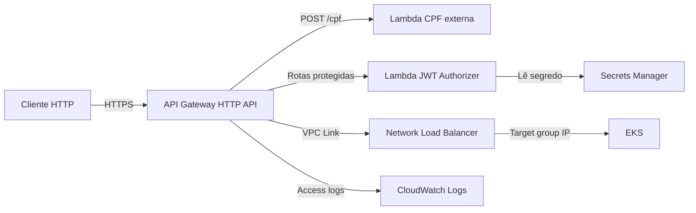

# Infraestrutura Kubernetes na AWS

Este repositório provisiona a infraestrutura compartilhada na AWS. A aplicação
Oficina é implantada por um repositório próprio.

O projeto foi preparado para ambientes AWS Academy/VocLabs: reutiliza um
`LabRole` existente e não tenta criar recursos IAM.

## Arquitetura



O AWS Load Balancer Controller é instalado por Helm no EKS e permanece como
componente de infraestrutura do cluster. Temporariamente, ele usa as
credenciais da role dos nodes EC2 via IMDSv2. O ServiceAccount
`kube-system/aws-load-balancer-controller` não possui annotation de IRSA.

## Serviços provisionados

| Área | Serviços e recursos |
| --- | --- |
| Rede | VPC, duas subnets públicas, duas privadas, Internet Gateway, NAT Gateway, Elastic IP e tabelas de rota |
| Containers | Cluster EKS, node group gerenciado, add-ons VPC CNI/CoreDNS/kube-proxy e AWS Load Balancer Controller |
| Balanço | Network Load Balancer, listener TCP e target group IP |
| Imagens | Repositórios ECR para a aplicação e para o CPF validator, ambos com lifecycle policy |
| API | API Gateway HTTP API, VPC Link, security group, integração ao NLB e integração à Lambda CPF externa |
| Autenticação | Lambda JWT authorizer, permissão de invocação pelo API Gateway e segredo JWT no Secrets Manager |
| Observabilidade | CloudWatch Log Group para access logs do API Gateway e New Relic Kubernetes via Helm |

A role existente indicada por `existing_iam_role_arn` continua sendo reutilizada
por EKS, nodes e o authorizer. A role dos nodes não é modificada por este
repositório. O controller recebe credenciais temporárias da pipeline por um
Secret Kubernetes criado em runtime; não cria OIDC Provider, role IRSA, trust
policy OIDC ou qualquer policy IAM. A ServiceAccount da aplicação `oficina-api`
não é alterada.

> **Separação de responsabilidades:** As rotas do API Gateway, o namespace da
> aplicação, Deployments, Services, HPA, ConfigMaps, Secrets e o
> `TargetGroupBinding` são gerenciados pelo repositório da aplicação.
> Consulte `docs/api-gateway-routes.md` para detalhes sobre as rotas.

## Tecnologias

- Terraform 1.9+
- AWS: VPC, EKS, ECR, Elastic Load Balancing, API Gateway v2, Lambda, Secrets Manager e CloudWatch
- Kubernetes, Helm e AWS Load Balancer Controller
- GitHub Actions com credenciais temporárias AWS

## Pré-requisitos

1. Terraform 1.9 ou superior.
2. AWS CLI autenticado para a conta de destino.
3. Uma Lambda CPF existente na conta/região de destino.
4. Uma role existente com confiança para `eks.amazonaws.com`, `ec2.amazonaws.com` e `lambda.amazonaws.com` (em VocLabs, normalmente `LabRole`).
5. Permissões AWS para criar os recursos listados acima e `iam:PassRole` para a role existente. Nenhuma permissão IAM adicional é necessária para este fluxo de credenciais da pipeline.

## Configuração por ambiente

O arquivo [environments/sandbox/terraform.tfvars](environments/sandbox/terraform.tfvars) contém os valores padrão do sandbox, inclusive:

- `lambda_cpf_validator_name`
- `existing_iam_role_arn`
- `eks_kubernetes_version`
- tamanhos do node group e CIDRs de rede

Para outra conta, atualize pelo menos o nome da Lambda, o ARN da role existente e as credenciais AWS.

## Execução local

```bash
terraform -chdir=terraform init
./scripts/plan-infrastructure.sh
./scripts/apply-infrastructure.sh
```

Para evitar confirmações interativas:

```bash
./scripts/apply-infrastructure.sh -auto-approve
```

O apply é dividido em duas fases: EKS/nodes primeiro (necessário para o
provider Helm) e depois os demais recursos, incluindo o AWS Load Balancer
Controller (que depende do EKS para o Helm). O node group depende explicitamente
das associações das tabelas de rota: isso garante que as subnets privadas tenham
rota via NAT antes de os nós tentarem alcançar a API do EKS.

### Credenciais temporárias do Load Balancer Controller

O node group é EC2 e usa `existing_iam_role_arn` como `node_role_arn`. Seu Launch
Template mantém `HttpEndpoint = enabled`, exige IMDSv2 (`HttpTokens = required`)
e define `HttpPutResponseHopLimit = 2`, permitindo que o pod do controller
consulte o IMDS através da rede do node. O Helm configura `region = us-east-1`,
usa a ServiceAccount `kube-system/aws-load-balancer-controller` e agenda o
controller no node group EC2.

Esta é uma mitigação temporária. A solução recomendada é migrar para IRSA ou
EKS Pod Identity quando a conta tiver as permissões administrativas necessárias.
Em AWS Academy/VocLabs, as credenciais permanecem válidas somente enquanto a
sessão durar. Quando `AWS_SESSION_TOKEN` expirar, atualize os três GitHub Secrets
e execute novamente a pipeline; o Secret será atualizado e o controller será
reiniciado automaticamente. O patch de ambiente é aplicado depois de cada
upgrade Helm porque o chart fixado não suporta as três referências `valueFrom`
necessárias (incluindo o session token) como configuração nativa.

Para usar outro arquivo de variáveis, informe um caminho absoluto:

```bash
TFVARS_FILE=/caminho/para/producao.tfvars ./scripts/apply-infrastructure.sh
```

## Provisioning pelo GitHub Actions

A pipeline executa validação e plano em pull requests; em pushes para `main`,
aplica as duas fases automaticamente.

> **State compartilhado:** a configuração atual usa state local. Antes de
> permitir que o job de apply gerencie um ambiente criado localmente, configure
> um backend remoto compartilhado (por exemplo, S3) e migre o state com
> `terraform init -migrate-state`. Sem isso, o runner do GitHub não conhece os
> recursos já criados e tentará recriá-los.

Configure estes GitHub Secrets em **Settings → Secrets and variables → Actions → Secrets**:

| Secret | Descrição |
| --- | --- |
| `AWS_ACCESS_KEY_ID` | Access key da conta de destino |
| `AWS_SECRET_ACCESS_KEY` | Secret access key da conta de destino |
| `AWS_SESSION_TOKEN` | Token da sessão temporária |

Configure estas GitHub Variables em **Settings → Secrets and variables → Actions → Variables**:

| Variable | Descrição | Padrão |
| --- | --- | --- |
| `LAMBDA_CPF_VALIDATOR_NAME` | Nome da Lambda CPF externa | `CpfValidatorTest` |
| `EXISTING_IAM_ROLE_ARN` | ARN da role reutilizada pelo EKS e Lambda authorizer | `arn:aws:iam::264040538379:role/LabRole` |

As GitHub Variables prevalecem sobre os valores do `terraform.tfvars` na pipeline. Assim, cada conta pode ter Lambda e role próprias sem alterar arquivos versionados.

> Credenciais temporárias expiram. Atualize os três GitHub Secrets quando a sessão VocLabs for renovada.

## VS Code

Em **Tasks: Run Task**, use:

- `terraform: plan` para planejar a próxima fase segura;
- `terraform: apply` para executar o fluxo completo.

## Verificação

```bash
terraform -chdir=terraform fmt -check
terraform -chdir=terraform validate
pytest tests/test_terraform_static.py -v
```

## Monitoring and Observability

O recurso `helm_release.newrelic` instala o chart oficial `nri-bundle` no
namespace dedicado `newrelic`, depois que o cluster EKS e o node group ficam
disponíveis. O provider Helm usa o endpoint, o certificado e o token do EKS já
definidos em `terraform/providers.tf`; não há provider Kubernetes adicional.
O nome enviado ao New Relic é `aws_eks_cluster.main.name`, portanto o ambiente
continua identificável pelo nome existente, sem duplicá-lo manualmente.

A instalação habilita o agente de infraestrutura, kube-state-metrics, eventos
Kubernetes e `newrelic-logging`. Isso permite observar CPU e memória de nodes e
pods, estado de nodes e pods, Deployments, restarts, workloads indisponíveis,
eventos e métricas gerais do cluster. O componente de logging fornece o
encaminhamento dos logs de containers; não altera o código ou o formato dos
logs da aplicação. A instrumentação APM e métricas de negócio ficam a cargo do
repositório da aplicação.

### Configuração do GitHub

Adicione o secret `NEW_RELIC_LICENSE_KEY` em **Settings → Secrets and
variables → Actions → Secrets**. A pipeline o expõe somente ao Terraform como
`TF_VAR_new_relic_license_key`; ele não é versionado, outputado ou escrito em
`terraform.tfvars`. Não é necessária GitHub Variable adicional para o New
Relic. A versão do chart pode ser sobrescrita por uma variável Terraform
`new_relic_chart_version` quando um ambiente precisar controlar o upgrade.

### Validação no Kubernetes

Após o apply, valide os componentes instalados:

```bash
kubectl get pods -n newrelic
kubectl get all -n newrelic
kubectl get daemonsets,deployments -n newrelic
kubectl get events -n newrelic --sort-by=.lastTimestamp
helm status newrelic -n newrelic
```

Os pods devem estar `Running`/`Ready` e o DaemonSet do agente e do logging
deve ter um pod pronto por node elegível. Para validar no New Relic, abra
**Infrastructure → Kubernetes** e procure o cluster pelo valor de
`terraform output -raw eks_cluster_name`; confirme nodes, workloads e eventos
recentes. A chegada inicial de dados pode levar alguns minutos.

Para remover e reaplicar somente a integração, use o fluxo normal do state:

```bash
terraform -chdir=terraform destroy -target=helm_release.newrelic \
  -var-file=../environments/sandbox/terraform.tfvars
TF_VAR_new_relic_license_key="$NEW_RELIC_LICENSE_KEY" \
  ./scripts/apply-infrastructure.sh
```

Não execute o `destroy` acima sem confirmar o target e as credenciais do
ambiente. O Terraform state poderá conter dados sensíveis necessários ao
provider, mas a license key não é exposta em outputs.
