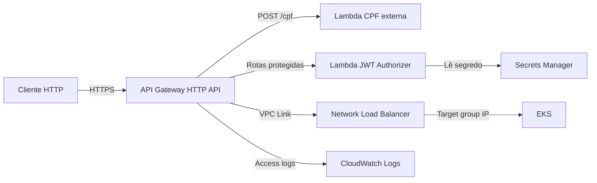

# Infraestrutura Kubernetes na AWS

Este repositório provisiona a infraestrutura compartilhada na AWS. A aplicação
Oficina é implantada por um repositório próprio.

O projeto foi preparado para ambientes AWS Academy/VocLabs: reutiliza um
`LabRole` existente e não tenta criar recursos IAM.

## Arquitetura



O AWS Load Balancer Controller é instalado por Helm no EKS e permanece como
componente de infraestrutura do cluster.

## Serviços provisionados

| Área | Serviços e recursos |
| --- | --- |
| Rede | VPC, duas subnets públicas, duas privadas, Internet Gateway, NAT Gateway, Elastic IP e tabelas de rota |
| Containers | Cluster EKS, node group gerenciado, add-ons VPC CNI/CoreDNS/kube-proxy e AWS Load Balancer Controller |
| Balanço | Network Load Balancer, listener TCP e target group IP |
| Imagens | Repositórios ECR para a aplicação e para o CPF validator, ambos com lifecycle policy |
| API | API Gateway HTTP API, VPC Link, security group, integração ao NLB e integração à Lambda CPF externa |
| Autenticação | Lambda JWT authorizer, permissão de invocação pelo API Gateway e segredo JWT no Secrets Manager |
| Observabilidade | CloudWatch Log Group para access logs do API Gateway |

Não são criadas roles IAM neste repositório. EKS, nodes e o authorizer usam
a role existente indicada por `existing_iam_role_arn`.

> **Separação de responsabilidades:** As rotas do API Gateway, o namespace da
> aplicação, Deployments, Services, HPA, ConfigMaps, Secrets e o
> `TargetGroupBinding` são gerenciados pelo repositório da aplicação.
> Consulte `docs/api-gateway-routes.md` para detalhes sobre as rotas.

## Tecnologias

- Terraform 1.9+
- AWS: VPC, EKS, ECR, Elastic Load Balancing, API Gateway v2, Lambda, Secrets Manager e CloudWatch
- Kubernetes e provider Terraform Kubernetes
- Helm e AWS Load Balancer Controller
- GitHub Actions com credenciais temporárias AWS

## Pré-requisitos

1. Terraform 1.9 ou superior.
2. AWS CLI autenticado para a conta de destino.
3. Uma Lambda CPF existente na conta/região de destino.
4. Uma role existente com confiança para `eks.amazonaws.com`, `ec2.amazonaws.com` e `lambda.amazonaws.com` (em VocLabs, normalmente `LabRole`).
5. Permissões AWS para criar os recursos listados acima e `iam:PassRole` para a role existente.

## Configuração por ambiente

O arquivo [environments/sandbox/terraform.tfvars](environments/sandbox/terraform.tfvars) contém os valores padrão do sandbox, inclusive:

- `lambda_cpf_validator_name`
- `existing_iam_role_arn`
- `eks_kubernetes_version`
- tamanhos do node group e CIDRs de rede

Para outra conta, atualize pelo menos o nome da Lambda, o ARN da role existente e as credenciais AWS.

## Execução local

```bash
terraform -chdir=terraform init
./scripts/plan-infrastructure.sh
./scripts/apply-infrastructure.sh
```

Para evitar confirmações interativas:

```bash
./scripts/apply-infrastructure.sh -auto-approve
```

O apply é dividido em duas fases: EKS/nodes primeiro (necessário para o
provider Kubernetes) e depois os demais recursos, incluindo o AWS Load Balancer
Controller (que depende do EKS para o Helm). O node group depende explicitamente
das associações das tabelas de rota: isso garante que as subnets privadas tenham
rota via NAT antes de os nós tentarem alcançar a API do EKS.

Para usar outro arquivo de variáveis, informe um caminho absoluto:

```bash
TFVARS_FILE=/caminho/para/producao.tfvars ./scripts/apply-infrastructure.sh
```

## Provisioning pelo GitHub Actions

A pipeline executa validação e plano em pull requests; em pushes para `main`,
aplica as duas fases automaticamente.

> **State compartilhado:** a configuração atual usa state local. Antes de
> permitir que o job de apply gerencie um ambiente criado localmente, configure
> um backend remoto compartilhado (por exemplo, S3) e migre o state com
> `terraform init -migrate-state`. Sem isso, o runner do GitHub não conhece os
> recursos já criados e tentará recriá-los.

Configure estes GitHub Secrets em **Settings → Secrets and variables → Actions → Secrets**:

| Secret | Descrição |
| --- | --- |
| `AWS_ACCESS_KEY_ID` | Access key da conta de destino |
| `AWS_SECRET_ACCESS_KEY` | Secret access key da conta de destino |
| `AWS_SESSION_TOKEN` | Token da sessão temporária |

Configure estas GitHub Variables em **Settings → Secrets and variables → Actions → Variables**:

| Variable | Descrição | Padrão |
| --- | --- | --- |
| `LAMBDA_CPF_VALIDATOR_NAME` | Nome da Lambda CPF externa | `CpfValidatorTest` |
| `EXISTING_IAM_ROLE_ARN` | ARN da role reutilizada pelo EKS e Lambda authorizer | `arn:aws:iam::264040538379:role/LabRole` |

As GitHub Variables prevalecem sobre os valores do `terraform.tfvars` na pipeline. Assim, cada conta pode ter Lambda e role próprias sem alterar arquivos versionados.

> Credenciais temporárias expiram. Atualize os três GitHub Secrets quando a sessão VocLabs for renovada.

## VS Code

Em **Tasks: Run Task**, use:

- `terraform: plan` para planejar a próxima fase segura;
- `terraform: apply` para executar o fluxo completo.

## Verificação

```bash
terraform -chdir=terraform fmt -check
terraform -chdir=terraform validate
pytest tests/test_terraform_static.py -v
```
