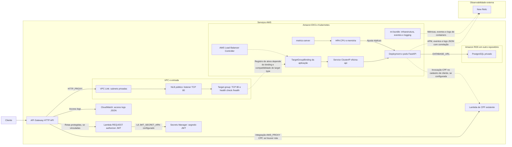

# Diagrama de componentes

O cliente entra pelo API Gateway HTTP API com stage `$default`. Uma integração `HTTP_PROXY` usa VPC Link nas subnets privadas e o ARN do listener TCP/80 do NLB público. O listener encaminha ao target group TCP/80, cujo health check HTTP consulta `/health`. O desenho da aplicação, em outro repositório, inclui `TargetGroupBinding` para um Service `ClusterIP` porta 80 e Deployment FastAPI porta 8000 no namespace `oficina`. A aplicação recebe `DATABASE_URL` por Secret Kubernetes e conecta-se ao RDS PostgreSQL privado provisionado por `database-infra` na mesma VPC. Essa cadeia depende de rotas e alvos corretamente instalados; não há rotas do Gateway nem registro de alvos no Terraform deste repositório.

[Fonte Mermaid](../diagrams/components.mmd).

O cluster EKS possui node group gerenciado em subnets privadas, add-ons VPC CNI, CoreDNS e kube-proxy, e AWS Load Balancer Controller instalado por Helm. O HPA da aplicação escala o Deployment entre 2 e 10 réplicas com metas de CPU 70% e memória 80%; o repositório da aplicação contém manifest do `metrics-server`. A configuração Terraform do target group omite `target_type`, portanto não é possível afirmar que ele aceite o binding `targetType: ip` sem checar o recurso efetivo na AWS. O NLB é marcado como público, embora o Gateway o acesse por VPC Link.

O authorizer é Lambda `REQUEST` associado ao Gateway, mas nenhuma rota o referencia aqui. O código valida JWT HS256 com segredo obtido de `JWT_SECRET_ARN` e retorna política IAM. A aplicação emite o token no login e revalida o Bearer com `CurrentUserDep`. O Secret JWT é criado neste repositório, porém a variável `jwt_secret_arn` do authorizer deve apontar para ele; esse vínculo não é estabelecido automaticamente no Terraform. Há ainda uma diferença entre a configuração de evento `2.0` do authorizer e os campos `authorizationToken`/`methodArn` consumidos pelo handler, que requer validação antes de afirmar que a autorização funcione no ambiente.

Em observabilidade, o Gateway grava access logs JSON no CloudWatch com `requestId`, status e latência. O chart `nri-bundle` instala infraestrutura Kubernetes, kube-state-metrics, eventos e encaminhamento dos logs de containers. O código da aplicação configura logs JSON com `correlation_id`, registra duração e status das requisições, inicializa o agente APM se houver chave e emite `ServiceOrderCreated` e `IntegrationError`. O NLB e as probes `/health` dão sinal de saúde, mas não há configuração comprovada de alerta/monitor sintético de uptime. O volume diário de ordens pode ser derivado dos eventos `ServiceOrderCreated` se forem recebidos; tempo médio por status e alertas específicos de falhas de ordens não estão configurados. Erros da integração CPF geram `IntegrationError`. Estas distinções evitam confundir capacidade de coleta com painel ou alerta já implantado.

Fontes principais: `terraform/api_gateway.tf`, `terraform/networking.tf`, `terraform/eks.tf`, `terraform/monitoring.tf`, `terraform/lambda/authorizer/index.py`, `terraform/secrets.tf`; no repositório da aplicação, `k8s/{deployment,service,hpa,target-group-binding,metrics-server}.yaml`, `src/api/main.py` e `src/infrastructure/observability/`.
