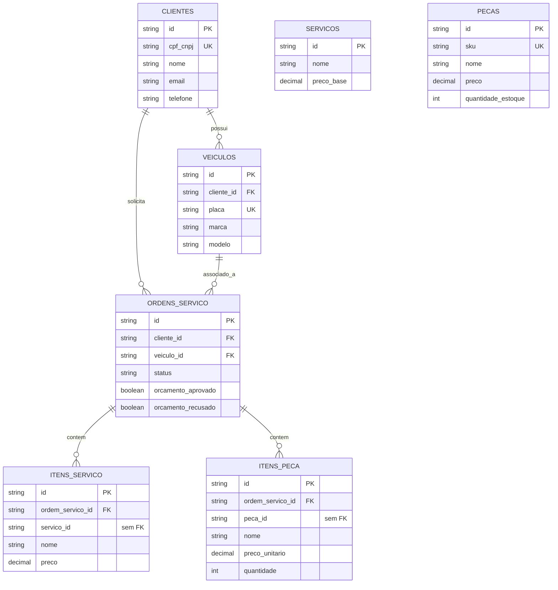

# Projeto do banco de dados

## Escolha e implantação

O modelo da Oficina possui clientes, veículos, ordens e itens com referências e valores monetários. PostgreSQL oferece chaves estrangeiras, unicidade, índices e transações para esse domínio; `database-infra` configura uma instância Amazon RDS com engine `postgres`, porta 5432, storage `gp3`, subnet group privado, security group na VPC compartilhada, backups automáticos (retenção configurável; padrão de um dia) e upgrade menor automático. O RDS reduz o trabalho operacional do banco em relação à hospedagem dentro do EKS. A instância atual é Single-AZ (`multi_az = false`), sem proteção de exclusão e com snapshot final omitido por padrão: disponibilidade Multi-AZ e recuperação por snapshot final não devem ser atribuídas a esta configuração. O repositório da aplicação lê endpoint do remote state do banco e fornece `DATABASE_URL` ao Deployment por Secret. Para desenvolvimento local, `settings.py` usa SQLite como padrão; isso não muda a escolha de PostgreSQL para a implantação AWS.

## Modelo efetivamente implementado

A migration `001_initial_schema.py` da aplicação cria sete tabelas. A tabela abaixo representa suas chaves, e o ER exibe somente os relacionamentos com FK realmente declarada.

| Entidade | PK | FKs declaradas | Dados e restrições relevantes |
| --- | --- | --- | --- |
| `clientes` | `id` (string 36) | — | `cpf_cnpj` único e obrigatório; nome, email e telefone obrigatórios |
| `veiculos` | `id` (string 36) | `cliente_id → clientes.id` obrigatória | `placa` única e obrigatória; marca, modelo e ano obrigatórios |
| `servicos` | `id` (string 36) | — | `preco_base` numeric(10,2) obrigatório; cadastro de catálogo |
| `pecas` | `id` (string 36) | — | `sku` único; preço numeric(10,2) e estoque |
| `ordens_servico` | `id` (string 36) | `cliente_id → clientes.id`, `veiculo_id → veiculos.id`, ambas obrigatórias | status, aprovação/recusa e datas; índices nas duas FKs |
| `itens_servico` | `id` (string 36) | `ordem_servico_id → ordens_servico.id` obrigatória | `servico_id` é apenas string, sem FK; nome e preço copiados |
| `itens_peca` | `id` (string 36) | `ordem_servico_id → ordens_servico.id` obrigatória | `peca_id` é apenas string, sem FK; nome, preço unitário e quantidade copiados |

[Fonte Mermaid](../diagrams/database-er.mmd).

As cardinalidades `1 → 0..N` decorrem das FKs em tabelas filhas: um veículo pertence a um cliente; uma ordem referencia um cliente e um veículo; uma ordem pode conter múltiplos itens de serviço e peça. Clientes, veículos e ordens podem existir sem filhos, pois não há restrição de mínimo na migration. A modelagem separa cadastros de ordens e preserva nome/preço dos itens como snapshot do orçamento mesmo que o catálogo mude. O diagrama mantém `servicos` e `pecas` isolados porque `itens_servico.servico_id` e `itens_peca.peca_id` não possuem FK; ligá-los no ER fingiria uma integridade que não existe.

As FKs protegem a existência de cliente, veículo e ordem referenciados; unicidade evita CPF/CNPJ, placa e SKU duplicados. A FK independente de `cliente_id` e `veiculo_id` na ordem **não** garante que o veículo pertença ao cliente indicado; o caso de uso de abertura também não verifica essa igualdade. Não há `CHECK` de status, quantidade ou estoque na migration. O repositório ORM faz commit da ordem antes de inserir os itens e depois outro commit para os itens, portanto a abertura completa não é uma única transação atômica. Esses são limites reais de integridade, sem presumir constraints ausentes.

Fontes: no repositório da aplicação, `migrations/versions/001_initial_schema.py`, `src/infrastructure/database/models/{cliente,veiculo,servico,peca,ordem_servico}_model.py`, `src/infrastructure/database/repositories/ordem_servico_repository.py`; no repositório de banco, `terraform/main.tf` e `terraform/variables.tf`.
